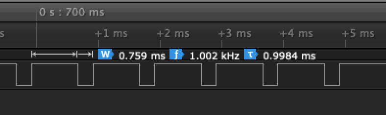
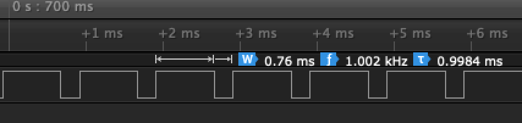
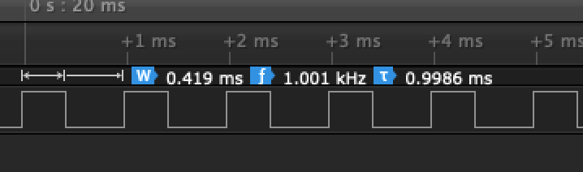
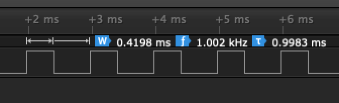
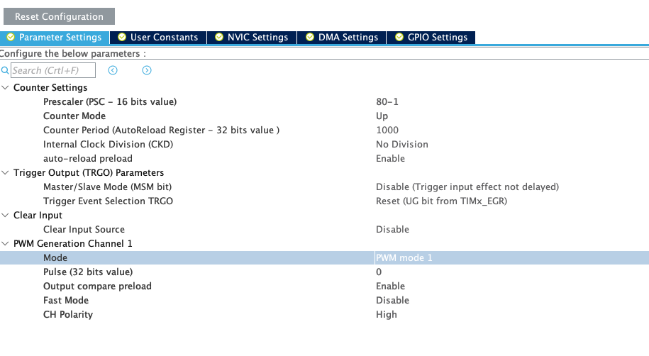

# Breathing LED
The point of this exercise is to show how to control the brightness of an LED by using a PWM signal.
In this case it is connected to the green LED on our board.

The output signals look like:

With the setup:

## Modification
Try to change the rate of "breathing" with the blue button.